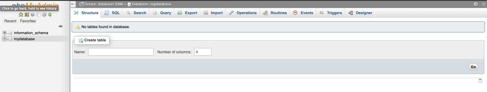

# TP - Docker-compose for development

L'objectif de cet exercice est le suivant: `Vous permettre de vous familiariser avec docker-compose (et sa configuration) pour automatiser la création d'un environnement incluant plusieurs containers` en assurant:
- la communication entre les différents containers à l'aide des `docker networks`.
- persister la donnée d'un container à l'aide des `docker volumes`/`mountpoints`.
- Exposer des applications (ports) à l'hôte local pour accéder à des applications qui tournent dans un container
- Configurer des containers à l'aide d'`environment variables`.

## L'Exercice

Cet exercice comprend plusieurs composants:
- 1 application (API back-end) `node` faisant appel à une base de donnée `MySQL` pour lire une liste de `messages` (id: int, content: varchar).
Cette application tournera sur votre ordinateur (et non pas dans un container) pour simuler un environnement de développement.
- 1 container `MySQL`: stocker la liste de `messages`.
- 1 container `phpmyadmin`: administrer la base de donnée MySQL à travers une interface graphique.

Au cours de l'exercice, vous serez amené à automatiser la création de l'environnement décrit ci-dessus à l'aide de `docker-compose` à travers [le fichier docker-compose.yml présent ici](./docker-compose.yml).

Le container MySQL devra être configuré (utilisateur, mot de passe utilisateur et ROOT, nom de la base), la donnée produite pendant le `run` d'un container devra être persisté en local, de sorte à ce que si l'on supprime le container (`docker rm` ou `docker-compose rm`) et qu'on le relance, la base soit dans le même état qu'avant la suppression. Ce container doit être accessible sur le port `3306` où le service mysql (tourne sur le port 3306 à l'intérieur du container), de sorte à ce que l'API node puisse accéder à la base.

Le container `phpmyadmin` devra être configuré (hôte/port du container MySQL ainsi que utilisateur/mot de passe de la base) pour se connecter au container MySQL pour vous permettre d'administrer la base de donnée depuis l'interface graphique. Cette interface graphique devra être accessible depuis un navigateur à l'addresse `http://localhost:8080`.

Les deux containers (phpmyadmin et mysql) communiqueront sur un `docker network` (pas de contrainte de nommage).

L'exercice est découpé par étapes ci-dessous.

## Pré-requis

- `node.js` installé sur votre ordinateur (version >= 8.0)
- `docker` et `docker-compose` installés

## Étapes à accomplir pour cet exercice:

### Configurer MySQL

Voir la documentation du repository [docker MySQL ici](https://hub.docker.com/_/mysql) (surtout la section `Environment Variables` and `where to store data`).

**Prenez la version 5.6 de mysql**.

#### 1. La configuration

En ce qui concerne la configuration (se référer à la documentation de l'image, voir le lien ci-dessus), nous souhaitons avoir la configuration suivante:
- Le mot de passe `root` (obligatoire, requis par l'image) doit être configuré `myrootpassword`.
- L'utilisateur (user) de la base: `test`
- Le mot de passe (password) de la base: `test`
- La base de donnée (database) doit s'appeler `mydatabase`

#### 2. Le stockage

Ici, on parle de `persistance` des données lorsque le container n'existe pas, pour vous permettre de `restaurer` l'état de la base de donnée lorsque le container est relancé.

Pour ce faire, nous allons utiliser un `mountpoint`

Veuillez donc vous assurer que la donnée soit persistée dans un dossier `mydata`, qui sera monté en tant que `volume` dans le container `database` au chemin suivant: `/var/lib/mysql`

#### 3. Le réseau

Ici, on a deux contraintes côté réseau:
- Le service dans le container doit être accessible depuis la machine hôte sur le port `3306` (pour que l'API puisse accéder à la base).
- Le service doit être accessible via un `docker network` pour que le container `phpmyadmin` puisse accéder à la base pour l'administrer.

**Quand on parle d'accéder à un service depuis la machine hôte, on parle du paramètre `ports`.**

En ce qui concerne le `docker network` (pour que phpmyadmin accède au service MySQL), il faut simplement que le container mysql soit sur le même réseau que le container phpmyadmin.

Pour ce faire:
- le réseau doit être mentionné dans le paramètre `networks` du service mysql.
- le réseau doit être déclaré dans le paramètre globale `networks`.


### Configurer phpmyadmin

Voir la documentation du repository [docker phpmyadmin ici](https://hub.docker.com/r/phpmyadmin/phpmyadmin) (surtout la partie `Environment Variables Summary`).

**Prenez la version 4.9**.

#### 1. La configuration

#### 2. Le stockage

#### 3. Le réseau

Côté réseau, le service dans le container doit être accessible depuis la machine hôte sur le port `8080`.

On parle donc du paramètre `ports` du service `phpmyadmin`.

Le service doit également être en mesure de communiquer avec le container `mysql`, à travers un `docker network`. Vous devrez donc mentionner le même `network` configuré pour le container `mysql` précédemment.

### On test tout ça

Pour tester que tout fonctionne correctement, suivez ces étapes:
- Démarrer les services spécifiés dans [le fichier docker-compose.yml](docker-compose.yml):
  ```bash
  docker-compose up
  ```
  Si des erreurs s'affiche ou qu'un des containers `exit`, il y a un problème dans votre configuration: cherchez, corrigez et réessayez.
- Accéder à l'interface graphique de phpmyadmin sur `http://localhost:8080`. Vous devriez être connecté directement à la base, comme ici:

**Attention toutefois, l'initialisation des containers peut prendre plusieurs secondes, veillez à attendre un peu car vous rencontrerez des erreurs si vous ouvrez le navigateur avant que mysql ne soit initialisé**.
- Vous pouvez simplement importer [le fichier database.sql ici](./database.sql) en le `drag-and-drop` n'importe où sur la page.
- Rafraichissez la page, vous devriez voir une table `messages`.
- De retour dans votre terminal, nous allons supprimer les containers puis les recréer, pour nous assurer que la donnée est bien persistée puis remontée:
  ```bash
  docker-compose down
  docker-compose up
  ```
- Ouvrez de nouveau `http://localhost:8080` dans un navigateur, vous devriez toujours voir la table `messages`:

- Ensuite, ouvrez un nouveau terminal, et `cd` dans le [dossier contenant l'application node](./app):
  ```bash
  npm install # ou yarn
  npm run start
  ```
- Ouvrez http://localhost:3000/messages, si tout s'est bien passé, vous devriez voir l'output suivant:
  ```json
  [
    {
      "id": 1,
      "content": "hello"
    },
    {
      "id": 2,
      "content": "world"
    },
    {
      "id": 3,
      "content": "docker"
    },
    {
      "id": 4,
      "content": "compose"
    }
  ]
  ```

L'exercice est à présent terminé.
