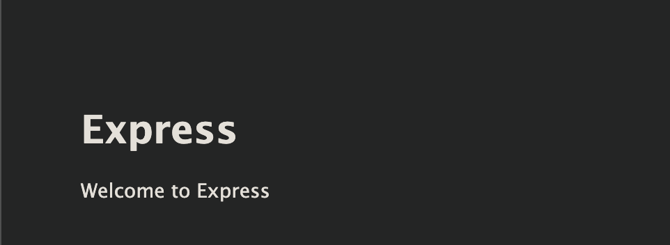

# TP - Docker images

Dans ce TP, vous vous familiariserez avec les Dockerfile: un outils vous permettant de `packager` vos applications dans un des images docker réutilisables.

Grâce aux `Dockerfiles`, vous serez en mesure de figer votre application à un instant T, dans une image docker qui vous servira par la suite à créer des containers.

Jusqu'ici, vous avez appris à utiliser les différentes ressources `docker`, pour créer des environnements en adressant les différentes problématiques de:
- Configuration (des containers)
- Stockage (volume)
- Réseau Network

Tout cela, en utilisant des `images docker` proposées par d'autres utilisateurs (`nginx`, `node:alpine`, `amasselot/zelda`). Maintenant, il est temps d'apprendre à créer ses propres images.

L'objectif de ce TP est de vous apprendre à utiliser le fichier `Dockerfile` pour construire des images docker à partir d'une application, vous permettant ainsi de porter cette application en tout simplicité vers de multiples environnements.

Ainsi, le jours où vous serez amené face à des problématiques de `mise en production` d'une application, vous aurez les cartes en main pour livrer votre produit sous la forme la plus `portable` possible: Une image Docker, pour potentiellement la déployer sur de l'infrastructure, avec les connaissances que vous avez accumulées jusqu'à présent sur le Docker.

## Exercice: Partie 1

Pour ce TP:
- [Utilisez le Dockerfile ici](./Dockerfile)
- L'application utilisée pour créer l'image docker [se trouve ici](./app): Simplement une API Back-end `express.js` (node.js)

Ici, les objectifs à atteindre à travers l'exercice:
- Votre nouvelle image (Dockerfile) devra étendre l'image `node:alpine`
- L'image doit spécifier un dossier courant `/home/node`
- Uniquement les **dépendances de production** devront être installées dans votre image
- L'ensemble du [code présent dans le dossier app](./app) doit être présent dans le dossier `/home/node` du container
- Par défaut, la commande exécutée au démarrage d'un container doit être `npm run start`

Une fois ces critères remplis dans votre fichier Dockerfile, pour vérifier que tout fonctionne correctement:
- Buildez l'image docker:
  ```bash
  # Il faut être dans le même dossier que Dockerfile
  docker build -t tp-images:latest .
  ```
  Le build doit se faire sans erreur.
- Testez votre image avec la commande suivante:
  ```bash
  docker run -p 3000:3000 tp-images:latest
  ```
  Le serveur node.js devrai démarrer sans problème **Vérifier ensuite dans votre navigateur que le résultat est le suivant**:

  
- L'application node utilisée dans ce TP utilise la variable d'environnement `PORT`, pour configurer le serveur Web. Testez à nouveau avec la commande suivante (en modifiant la variable PORT, pour s'assurer que l'image buildée est bien sensible à ce paramètre):
  ```bash
  docker run --rm -e PORT=2000 -p 3000:2000 tp-images:latest
  ```
  Ouvrez votre navigateur sur http://localhost:3000 à nouveau, vous devriez observer le même résultat que précédemment.

## Exercice: Partie 2

Dans cette seconde partie, vous allez reconstruire l'image `amasselot/zelda` (que nous avons déjà utilisé au cours des TP précédents).

Le site est développé en utilisant `Webpack` pour facilier le workflow de dev front, il faudra donc utiliser la commande `npm run build` pour générer les fichiers statiques (html, js, png, css) dans le dossier `build`.

On peut utiliser une image `nginx:alpine` pour servir ces fichiers statiques comme on l'a vu précédemment (les fichiers statiques doivent se trouver dans le dossier `/usr/share/nginx/html`).

- Téléchargez ou installez le projet qui contient le code du site zelda [est disponible sur ce repo Github](https://github.com/AmFlint/hetic-w2-p2019-05)
- L'image à utiliser: `nginx:alpine`
- La commande `npm run build` sert à générer le site (les fichiers `html`) dans le dossier `build`.
- Le dossier `build` produit pas la commande `npm run build` doit être déplacé vers le dossier `/usr/share/nginx/html` qui sera servi par le serveur Web ngin.
