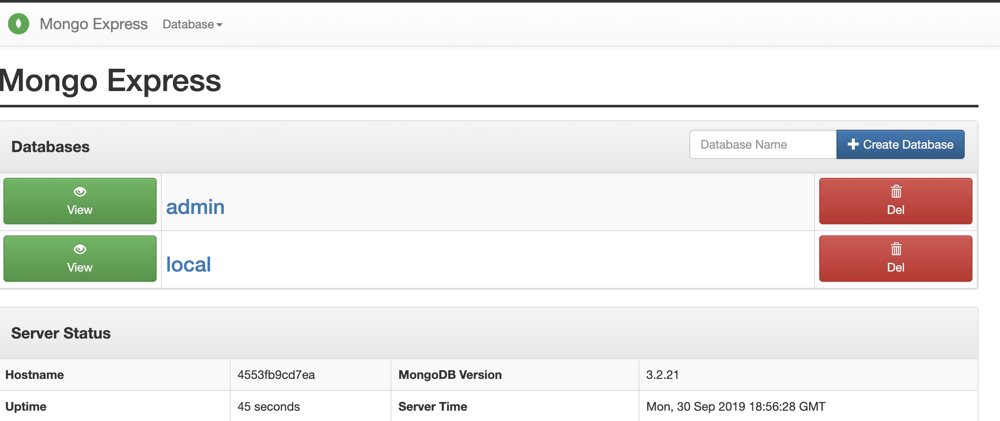

# TP - Le réseau dans Docker

La problématique de ce TP: Comment faire communiquer plusieurs containers ?

Il existe plusieurs méthodes pour permettre à des containers de communiquer entre eux:
- À l'aide du paramètre `link`: Manuellement `relier` un container à un autre container:
  ```bash
  # Ici, on créer le premier container
  docker run --name my-container alpine sleep 3600
  # on créer le deuxième container, et lui donne l'accès réseau au premier, nommé "my-container" avec le paramètre --links
  docker run --name second-container --link my-container alpine sleep 3600
  ```
  Cette technique est assez peu utilisée, car nécessite de manuellement indiquer pour chaque container à quel autre container il a accès.
- À l'aide la ressource `docker network`: Une nouvelle ressource docker (comme les `volumes`). On peut configurer un container pour utiliser un `docker network` particulier, il aura ainsi l'accès à tous les autres containers présents sur le même réseau:
  ```bash
  # On créer un réseau
  docker network create my-network
  # Ici, on créer deux containers distincts, et on les configure pour utiliser le même réseau: my-network
  docker run --name my-container --network my-network alpine sleep 3600
  docker run --name second-container --network my-network alpine sleep 3600
  ```

**Quand la communication réseau est configurée entre plusieurs containers, ils peuvent intéragir grâce au `container-name` attribué aux autres containers** (Docker possède un système DNS en interne, il va assigner un nom de domaine à chaque container, le nom de domaine du container étant le nom du container).
Donc, par exemple:
- avec `link`:
  ```bash
  docker run -d --name my-container alpine sleep 3600
  docker run -d --name second-container --link my-container alpine sleep 3600
  ```
- avec `docker network`:
  ```bash
  docker network create my-network
  docker run -d --name my-container --network my-network alpine sleep 3600
  docker run -d --name second-container --network my-network alpine sleep 3600
  ```

Ici, peu importe l'exemple utilisé, pour intéragir avec le premier container, nommé `my-container` (paramètre `--name`) depuis le second container, on peut utiliser le nom de domaine:
```bash
# On exécute la commaned `ping my-container` dans le container second-container.
docker exec second-container ping my-container
PING my-container (172.17.0.2): 56 data bytes
64 bytes from 172.17.0.2: seq=0 ttl=64 time=5.411 ms
64 bytes from 172.17.0.2: seq=1 ttl=64 time=0.155 ms
64 bytes from 172.17.0.2: seq=2 ttl=64 time=0.185 ms
64 bytes from 172.17.0.2: seq=3 ttl=64 time=0.152 ms
```
On voit que le container `my-container` répond, et que le système DNS de docker prend soin de transformer l'hôte `my-container` en addresse IP (celle attribuée automatiquement au container my-container), dans cet exemple `172.17.0.2`.

Ce TP est l'occasion de rassembler tout ce que vous avez pu voir jusqu'ici, avec:
- Lancer un container
- Exécuter des commandes dans un containers
- Gérer la donnée (volumes) dans un container

Et d'ajouter une nouvelle notion: `Gérer la communication réseau entre différents containers`.

## L'exercice

Au cours de cet exercice, vous allez travailler avec deux containers:
- **MongoDB**: Moteur de Base de données NoSQL (stock des documents), il utilisera un volume docker pour persister ses données.
- **Mongo-Express**: Interface graphique permettant l'administration d'une base de donnée Mongo DB (développée avec Express.js, d'où le nom). Ce container aura besoins de se connecter au container `mongo`.

Ici, vous serez livré à vous même (à travers la documentation des différentes images sur hub.docker.com) pour trouver comment configurer vos containers.

### Les contraintes

**Les données doivent être persistées (pour mongo) avec un volume, c'est à dire que si l'on supprime le container puis en recréer un nouveau, les données crées précédemment doivent être toujours présente**.

#### Container Mongo:

Réferez vous à la [documentation officielle de l'image mongo](https://hub.docker.com/_/mongo) pour découvrir comment la configurer. (L'objectif est de vous forcer à chercher les informations de vous même, pour le jours où vous devrez vous débrouiller seul):
- Vous utiliserez l'image `mongo:3.2`
- Le container doit s'appeler `tp-docker-mongo`
- Persister les données `en local` (à l'aide de Volumes: Docker volume ou mountpoint, à votre convenance).
- Configurer le `init root user et password`:
  - `user`: `tp-docker`
  - `root`: `tp-docker-password`

#### Container Mongo-Express:

Référez vous à la [documentation officielle de l'image mongo-express](https://hub.docker.com/_/mongo-express) pour découvrir la configuration.
- Vous utiliserez l'image `mongo-express:0.49`
- L'application mongo-express doit être accessible depuis un navigateur sur le port `8080`.
- Mongo-Express doit avoir accès en réseau (à travers `link` dans la première partie de l'exercice, puis avec un `network` dans la seconde).
- Mongo-Express doit avoir accès à la base de donnée Mongo du premier container (configurer `user` et `password`) **Attention, on parle ici d'un cas très simple: le cas ADMIN** (suivez la documentation).

#### Vérifications

Si votre installation fonctionne correctement, vous devriez voir le résultat suivant:


Si vous souhaitez vérifier que vos volumes fonctionnent:
- Créer une base de donnée (en haut à droite `Create Database`)
- Supprimez le container mongo
- Recréez le avec la même commande utilisée précédemment
- Ouvrez l'interface `mongo-express` à nouveau, votre base devrait être présente.
